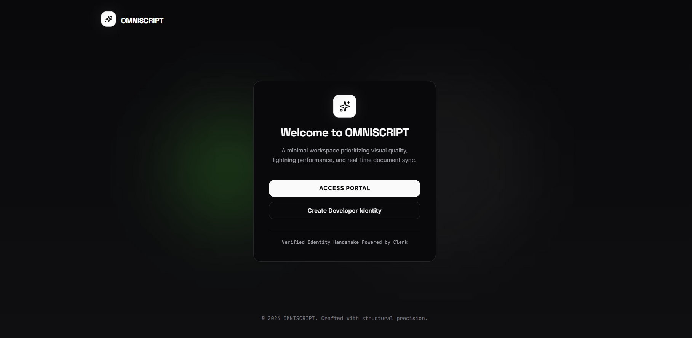
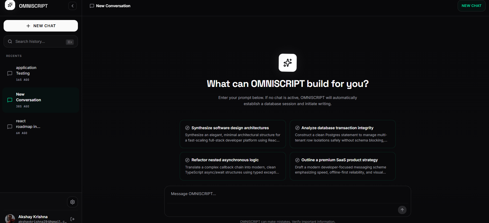
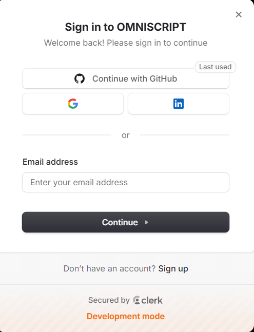
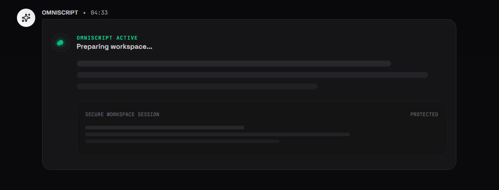

# OMNISCRIPT

OMNISCRIPT is a production-style AI SaaS workspace for persistent chat. It combines authenticated conversations, streaming OpenAI responses, server-side tools including Tavily web search, and PostgreSQL-backed conversation branching.

# 📸 Application Screenshots

## Landing Page



> The OMNISCRIPT landing workspace for starting a new persistent chat.

## Hero Section



> Suggested prompts and the chat composer in the empty-conversation experience.

## Authentication



> Clerk-powered sign-in screen for authenticated workspace access.

## Chat Initialization


> Loading feedback while OMNISCRIPT prepares an assistant response.

## Streaming Response



> The main chat workspace displaying streamed assistant output.

## Technology Stack

### Frontend

- React 19 and TypeScript
- Vite 6 and Tailwind CSS 4
- Motion for React interface transitions
- TanStack React Query for server-state caching
- Clerk React for authentication UI and session tokens
- React Markdown with remark-gfm for message rendering
- Lucide React icons

### Backend

- Node.js with Express and TypeScript
- OpenAI AI SDK with the OpenAI provider
- Tavily Search API for server-side web search
- Clerk Backend for bearer-token verification
- Zod request and tool-input validation
- Prisma Client for database access

### Database

- PostgreSQL
- Prisma schema and checked-in Prisma migrations

### Infrastructure

- Vercel-compatible Vite frontend deployment
- Render-compatible Express backend deployment
- Git and GitHub source control

## Application Workflow

1. The browser loads the application and Clerk resolves the current session.
2. Signed-in users can create a conversation or open a persisted one; signed-out users see the authentication entry points.
3. React Query retrieves the conversation list, branch metadata, and branch-specific message history.
4. A submitted message creates a conversation when necessary, persists the user message, and resolves the active branch.
5. The backend verifies the Clerk bearer token, validates the request, checks conversation ownership, and appends the message to the selected branch.
6. The streaming route rebuilds branch-safe history and asks the OpenAI model to respond or select a registered tool.
7. Calculator, current date and time, and Tavily web search execute on the server when selected. Their state and final text stream to the client over Server-Sent Events.
8. Tool output is supplied back to the model for a final natural-language response. Assistant text and tool metadata are stored in the assistant message content.
9. React Query invalidates the relevant conversation, branch, and message entries so persisted history remains visible after refresh.
10. Branches share history before their fork point and retain independent continuation history afterward. Rename and conversation deletion operate on persisted records; pinning is stored locally in the browser.
11. Branch-aware message deletion removes dependent message lineage and branches transactionally while preserving unrelated branches. When no messages remain, the conversation is removed and the UI returns to New Chat.

## Repository Structure

```text
.
├── src/
│   ├── App.tsx                 # Primary chat workspace and streaming client
│   ├── actions/                # Validated server action layer
│   ├── components/             # Chat, sidebar, settings, tool, and UI components
│   ├── hooks/                  # React Query chat hooks and interaction hooks
│   ├── lib/                    # AI, Prisma, validation, repository, and tool modules
│   └── providers/              # Clerk, React Query, settings, accent, and toast providers
├── prisma/
│   ├── schema.prisma           # PostgreSQL models and relations
│   └── migrations/             # Versioned database migrations
├── public/                     # Browser assets, including the favicon
├── server.ts                   # Express API, auth middleware, and streaming route
├── vite.config.ts              # Vite and frontend environment configuration
└── .env.example                # Environment variable names and placeholders
```

## Local Development

1. Clone the repository and install dependencies:

   ```bash
   npm install
   ```

2. Copy `.env.example` to `.env` and configure local values.
3. Generate the Prisma client:

   ```bash
   npx prisma generate
   ```

4. Apply pending migrations when connecting a new local database:

   ```bash
   npx prisma migrate dev
   ```

5. Start the development server:

   ```bash
   npm run dev
   ```

## Environment Variables

`.env` stores local secrets and is ignored by Git. `.env.example` contains placeholders only. Backend secrets must never be exposed through `VITE_` or `NEXT_PUBLIC_` variables.

| Variable | Purpose | Scope |
| --- | --- | --- |
| `OPENAI_API_KEY` | OpenAI model access | Backend secret |
| `TAVILY_API_KEY` | Tavily web search access | Backend secret |
| `CLERK_SECRET_KEY` | Clerk token verification in Express | Backend secret |
| `NEXT_PUBLIC_CLERK_PUBLISHABLE_KEY` | Clerk browser client configuration | Frontend public |
| `DATABASE_URL` | Preferred PostgreSQL connection string | Backend secret |
| `SQL_HOST` | Cloud SQL or PostgreSQL host fallback | Backend secret |
| `SQL_DB_NAME` | PostgreSQL database name fallback | Backend secret |
| `SQL_USER` | PostgreSQL user fallback | Backend secret |
| `SQL_PASSWORD` | PostgreSQL password fallback | Backend secret |
| `PORT` | Express listen port; defaults to `3000` | Backend runtime |
| `APP_URL` | Comma-separated browser origins permitted by the API | Backend runtime |
| `VITE_API_BASE_URL` | Optional API origin for a separately deployed frontend | Frontend public |
| `DISABLE_HMR` | Disables Vite HMR and file watching when set to `true` | Development runtime |

## Scripts

| Command | Description |
| --- | --- |
| `npm run dev` | Starts the TypeScript Express server with Vite middleware in development. |
| `npm run build` | Builds the Vite frontend and bundles the Express server to `dist/server.cjs`. |
| `npm run start` | Starts the bundled production server. |
| `npm run preview` | Starts the Vite static preview server. |
| `npm run lint` | Runs `tsc --noEmit`. |
| `npm run clean` | Removes `dist` and `server.js`. |

## Deployment

### Frontend

The Vite frontend can be deployed to Vercel. Set `NEXT_PUBLIC_CLERK_PUBLISHABLE_KEY`; when the API is hosted separately, set `VITE_API_BASE_URL` to the Render API origin. Leave `VITE_API_BASE_URL` empty when Express serves the built frontend from the same origin.

### Backend

The Express service can run on Render with `npm run build` followed by `npm run start`. Configure `OPENAI_API_KEY`, `CLERK_SECRET_KEY`, `TAVILY_API_KEY` when web search is enabled, and a PostgreSQL connection. Render supplies `PORT`; the server honors it. For separate frontend deployment, set `APP_URL` to the Vercel origin or a comma-separated set of allowed origins.

### Database

Use PostgreSQL with either `DATABASE_URL` or the supported `SQL_*` fallback values. Run `npx prisma generate` during build or deployment setup and apply migrations through the normal Prisma migration workflow before serving production traffic.
